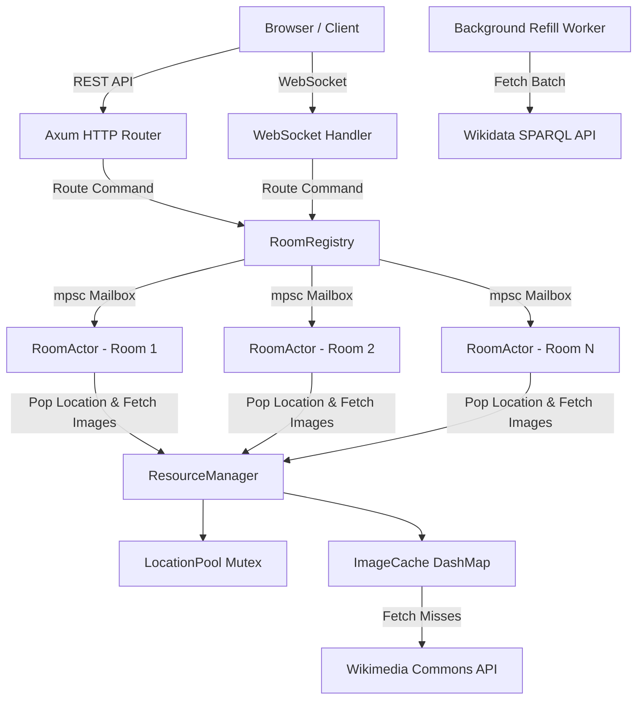

# WikiGuessr Backend Architecture Specification (v3)

Authoritative multiplayer and single-player backend for WikiGuessr, built in Rust (2024 edition) using Axum, Tokio, and Wikimedia APIs.

---

## 1. Overview & System Architecture

The WikiGuessr backend is **server-authoritative**. Clients (web frontend or mobile) render the UI, display Wikimedia images, allow map interaction, and submit guesses. They never compute game state, fetch Wikimedia APIs directly, or calculate scores.

### Key Goals
- **Server Authority**: Prevents cheating by resolving rounds, deadlines, and scoring exclusively on the backend.
- **Lock-Free Concurrency**: Each active room runs as an independent Tokio task (`RoomActor`). Rooms communicate via async message passing (`mpsc`), eliminating cross-room locks and lock-held-across-await hazards.
- **Unified Game Engine**: Single-player and multiplayer share the exact same room actor state machine. Single-player is simply a 1-player room driven by REST endpoints instead of WebSockets.
- **Resilient Resource Pipeline**: Pre-fetches geotagged locations into a pool with background workers and caches Commons image sets with jittered TTL.



---

## 2. Identification System (`ids.rs`)

To optimize memory usage and performance, the backend replaces UUIDs with 64-bit unsigned integers:

- **`RoomId(pub u64)`**: Unique room identifier, generated via `rand::random::<u64>()`.
- **`PlayerId(pub u64)`**: Monotonically increasing connection/session ID generated via `AtomicU64::fetch_add(1)`.
- **`RoomCode(pub String)`**: A 6-character human-shareable alphanumeric string (e.g., `"X7K2M3"`) derived from `RoomId` using a 32-character non-ambiguous alphabet (`A-Z` minus `I,O` + `2-9`).

The `RoomRegistry` maintains bidirectional lookups between `RoomId` and `RoomCode`.

---

## 3. Concurrency & Room Actor Model (`rooms/actor.rs`, `rooms/registry.rs`)

### Room Actor (`RoomActor`)
Each active room is spawned as a dedicated Tokio task running an event loop:

```rust
pub async fn run(mut self) {
    let mut inactivity_timer = tokio::time::interval(inactivity_duration);
    loop {
        tokio::select! {
            cmd_option = self.mailbox.recv() => {
                match cmd_option {
                    Some(cmd) => if !self.handle_command(cmd).await { break; },
                    None => break,
                }
            }
            _ = inactivity_timer.tick() => break,
        }
    }
}
```

### Communication Channels
- **Inbound Commands (`RoomCommand`)**: Sent into the actor's `mpsc::Receiver` mailbox.
- **Outbound Events (`RoomEvent`)**: Broadcast to connected clients over per-player `mpsc::UnboundedSender` channels.
- **REST Feedback**: Commands sent from REST endpoints include a `tokio::sync::oneshot::Sender` to receive an immediate response (e.g. guess score or join confirmation) without needing a WebSocket.

---

## 4. Resource Management & Wikimedia Pipeline (`resources/`)

The resource layer isolates all external Wikimedia API interactions:

```
src/resources/
  manager.rs    // Unified ResourceManager coordinating clients, pool, and cache
  wikidata.rs   // WikidataClient (SPARQL query & parsing)
  commons.rs    // CommonsClient (geosearch & image relevance ranking)
  pool.rs       // LocationPool (Mutex<VecDeque<Location>>)
  cache.rs      // ImageCache (DashMap with jittered TTL)
```

### Location Pool & Worker
- **Background Worker**: Spawns a Tokio task at boot. Whenever `LocationPool.len()` drops below `pool_refill_threshold` (default: 300), it fetches a batch of 200 random geotagged locations from Wikidata via SPARQL.
- **Polar Filtering**: Locations with $|\text{latitude}| > 70^\circ$ are filtered out post-parse to exclude uninhabited polar ice fields.

### Commons Image Selection & Geo-Ranking
When a location is loaded for a round, `CommonsClient` fetches up to 50 candidate images within a 10 km radius:
1. **Format Exclusion**: Rejects non-`BITMAP` media (SVG, PDF, audio, video).
2. **Category Exclusion**: Rejects portraits, logos, coats of arms, and flags.
3. **Satellite Exclusion**: Rejects orbital/space imagery matching terms like `"satellite image"`, `"landsat"`, `"copernicus"`, `"from space"`.
4. **Geo-Relevance Scoring**: Ranks remaining images by matching 28 terrain keywords (`landscape`, `mountain`, `river`, `valley`, `coast`, `volcano`, etc.) and returns the top 20 image URLs.

### Image Cache with Jittered TTL
Fetched image sets are cached in `ImageCache` using a `DashMap`. To avoid thundering herd expirations:
$$\text{TTL} = \text{base\_ttl} (24\text{h}) \pm \text{uniform\_random}(0, 2\text{h})$$

---

## 5. Rules & Scoring Engine (`rules.rs`, `scoring.rs`)

### Game Rules State Machine
Game flow is driven by pure state transitions:

```
Lobby  ── AllPlayersReady ──>  InRound(RoundNumber(1))
                                      │
                                  RoundEnded
                                      │
                                      ▼
                        InRound(RoundNumber(n+1))  OR  Finished
```

### Exponential Scoring Formula
Distance between the player's guess coordinate and the actual location coordinate is calculated using the **Haversine formula**:

$$\text{distance} = 2 \cdot R \cdot \arcsin\left(\sqrt{\sin^2\left(\frac{\Delta \phi}{2}\right) + \cos(\phi_1)\cos(\phi_2)\sin^2\left(\frac{\Delta \lambda}{2}\right)}\right)$$

Points (0 to 5,000) decay exponentially with distance:

$$\text{score} = \text{clamp}\left(\operatorname{round}\left(5000 \cdot e^{-\frac{\text{distance}}{2000\text{m}}}\right), 0, 5000\right)$$

### Guess Idempotency
Each player has exactly one guess slot per round (`HashMap<PlayerId, Coordinate>`). Duplicate guesses within the same round return an `already_guessed` error.

---

## 6. API Reference

### REST Endpoints

| Method | Path | Description |
|---|---|---|
| `POST` | `/api/solo/start` | Spawns a 1-player room, readies player, returns `room_code`, `player_id`, `player_token`. |
| `POST` | `/api/solo/guess` | Submits guess coordinates `{room_code, player_id, latitude, longitude}`, returns score. |
| `POST` | `/api/rooms` | Creates a multiplayer room, returns `room_id`, `room_code`, `join_code`, `host_token`. |
| `GET` | `/api/rooms/:code` | Returns room availability status `{room_code, active}`. |
| `POST` | `/api/rooms/:code/join` | Joins a multiplayer room with `join_code` & `name`, returns `player_id` & `player_token`. |
| `GET` | `/api/health` | Returns backend health status `{status: "ok", active_rooms, pool_size}`. |

### WebSocket Endpoint (`GET /api/ws?room_code=...&player_id=...`)

#### Incoming Client Messages (`ClientWsMessage`)
```json
{ "type": "ready" }
{ "type": "guess", "seq": 1, "latitude": 51.5074, "longitude": -0.1278 }
{ "type": "ping" }
{ "type": "leave" }
```

#### Outgoing Server Events (`RoomEvent`)
```json
{ "type": "player_joined", "player_id": 2, "name": "Alex" }
{ "type": "player_ready", "player_id": 2 }
{ "type": "round_started", "round": 1, "total_rounds": 5, "images": [...], "deadline_unix_ms": 1785189200000 }
{ "type": "guess_ack", "player_id": 2, "seq": 1 }
{ "type": "round_ended", "round": 1, "scores": [...], "actual_location": { "latitude": 48.8566, "longitude": 2.3522 }, "item_id": "Q42" }
{ "type": "leaderboard", "standings": [...] }
{ "type": "game_finished", "final_standings": [...] }
{ "type": "error", "code": "guess_error", "message": "already_guessed" }
```

---

## 7. Codebase Structure

```
src/
  main.rs               // Axum router setup, CORS, tracing, background task initialization
  app_state.rs          // Shared AppState (Config, Arc<ResourceManager>, Arc<RoomRegistry>)
  config.rs             // Config, GameConfig, ServerConfig with env overrides
  errors.rs             // AppError enum with Axum IntoResponse
  ids.rs                // RoomId, PlayerId, RoomCode types
  image.rs              // Image & ImageSet structs
  location/
    coordinates.rs      // Coordinate, Location, ItemId, Guess types & validation
  resources/
    manager.rs          // ResourceManager & background pool refill worker
    wikidata.rs         // WikidataClient (SPARQL query & polar filter)
    commons.rs          // CommonsClient (geosearch & image relevance ranking)
    pool.rs             // LocationPool (Mutex<VecDeque>)
    cache.rs            // ImageCache (DashMap with jittered TTL)
  rooms/
    actor.rs            // RoomActor event loop & timer handling
    registry.rs         // RoomRegistry (DashMap of mpsc mailboxes & code lookups)
    state.rs            // RoomState, PlayerState, RoundState
    commands.rs         // RoomCommand enum
    events.rs           // RoomEvent enum
  rules.rs              // Pure GameStatus transition rules
  scoring.rs            // Haversine distance & exponential score calculation
tests/
  api_test.rs           // Integration tests for HTTP REST endpoints
```
